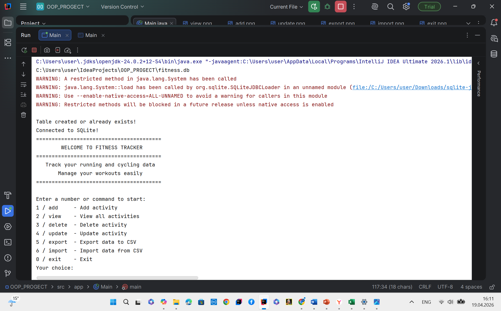
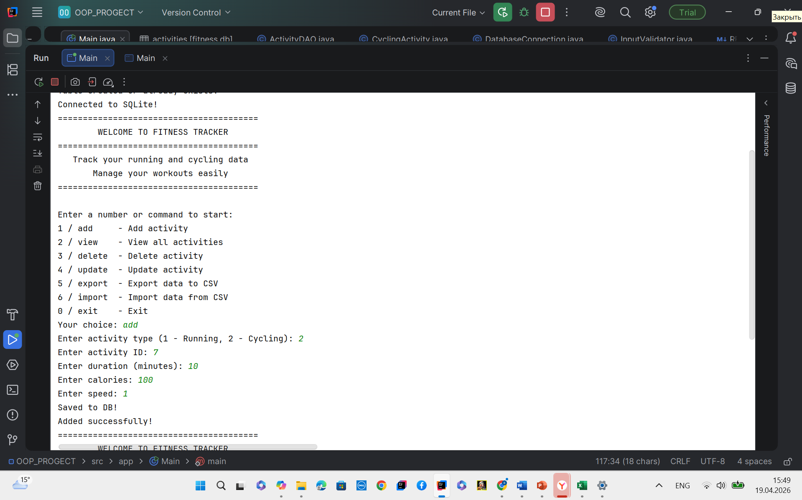
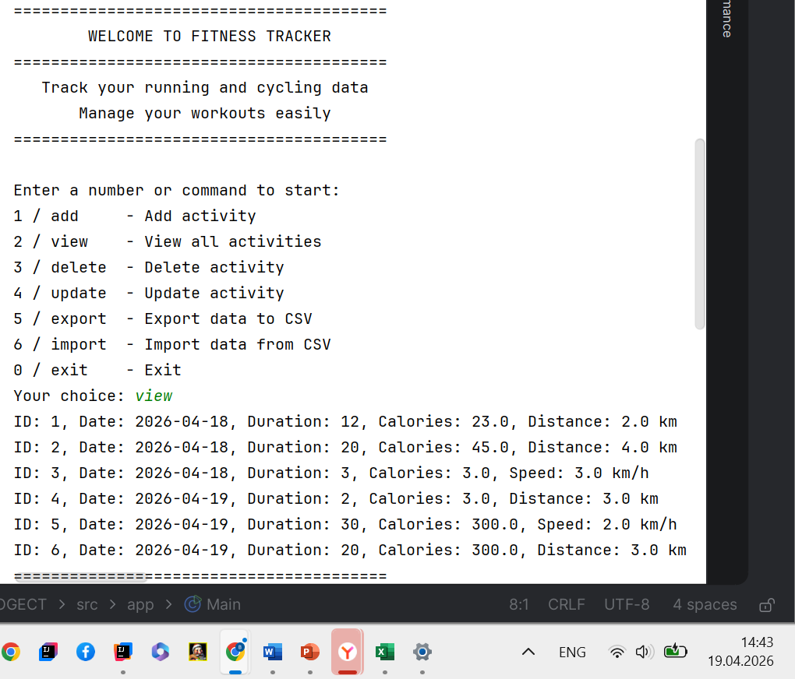
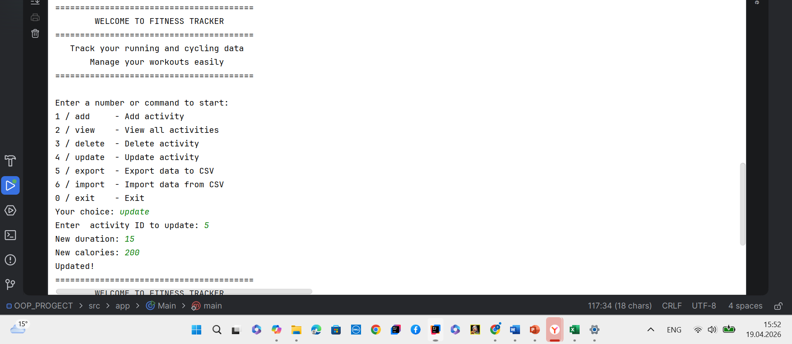
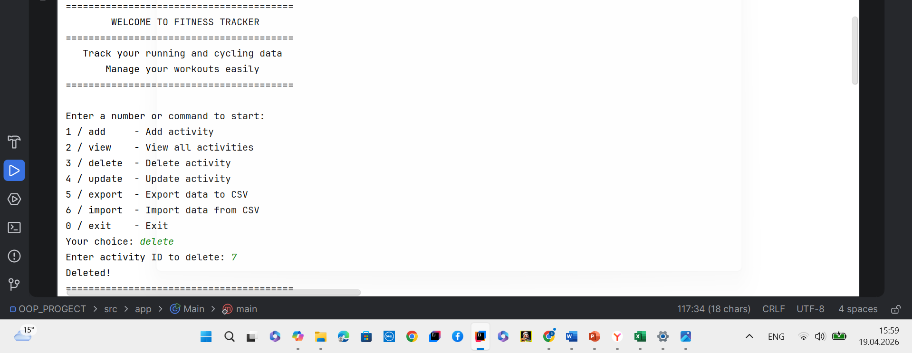
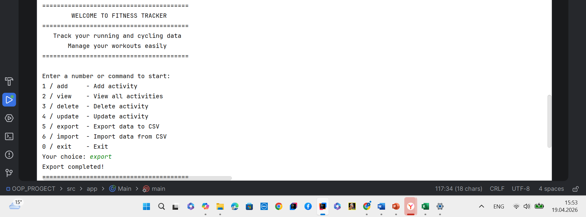
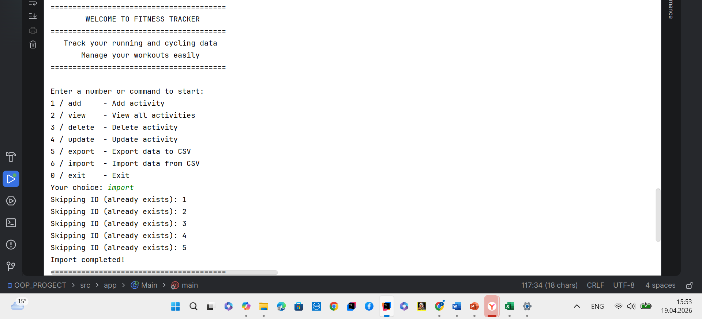

# Fitness Tracker OOP Project

## Student
Baias Zholdoshbekov

---

## Project Description
This project is a console-based Java application designed for managing physical activities such as running and cycling. The system provides functionality for creating, reading, updating, and deleting activity records.

The application uses SQLite for data persistence and supports CSV file import and export. The project is implemented using Object-Oriented Programming principles and follows a modular architecture.

---

## Objectives
- Implement CRUD operations for managing activities
- Apply Object-Oriented Programming principles
- Use SQLite database for persistent storage
- Implement file-based import and export (CSV)
- Develop a command-line interface application
- Apply input validation and error handling
- Use modular software architecture

---

## Functional Requirements
- Create new activity (Running, Cycling)
- Read and display all activities
- Update existing activity by ID
- Delete activity by ID
- Validate user input
- Handle runtime errors
- Store data in SQLite database
- Export data to CSV file
- Import data from CSV file
- Separate code into logical modules

---

## Object-Oriented Programming Principles

### Encapsulation
- All fields in model classes are declared private
- Access provided through getters and setters

### Inheritance
- Activity class is the parent class
- RunningActivity and CyclingActivity are child classes

### Polymorphism
- Method overriding is used in displayInfo() and toFileString()
- Runtime polymorphism is applied through base class references

---

## Data Structures
- ArrayList is used for in-memory storage of Activity objects
- SQLite relational database is used for persistent storage
- CSV file is used for external data storage and exchange

---

## System Architecture

### app package
- Main class responsible for CLI interaction

### model package
- Activity (base class)
- RunningActivity (child class)
- CyclingActivity (child class)

### service package
- ActivityDAO (database operations)
- ActivityService (business logic)
- DatabaseConnection (connection handling)

### util package
- InputValidator (input validation methods)

---

## Algorithms

### CRUD Operations
- Create: validate input and insert into database
- Read: retrieve records from database and display
- Update: find record by ID and update fields
- Delete: remove record by ID

### CSV Export
- Retrieve all records from database
- Convert each record to CSV format
- Write data to file

### CSV Import
- Read file line by line
- Split data by comma
- Validate and convert data types
- Insert records into database

---

## Data Persistence

### SQLite Database
- Stores all activity records
- Ensures persistence between sessions

### CSV Files
- Used for data export and import
- Provides external data backup

---

## Error Handling
- Input validation for numeric values
- Exception handling using try-catch blocks
- Prevention of duplicate IDs
- Handling of database connection errors

---

## Test Cases

### Add Activity
Input:
add → Running → ID: 1 → duration: 30 → calories: 250 → distance: 5

Output:
Saved to database

---

### View Activities
Output:
List of all stored activities with details

---

### Export Data
Output:
Export completed

---

### Import Data
Output:
Import completed

---

## How to Run
1. Open project in IntelliJ IDEA
2. Configure SQLite JDBC driver
3. Run Main.java
4. Use command-line menu to interact with system

---
## Challenges Faced
- Faced issues with duplicate IDs during CSV import and ensured data consistency in the database.
- 
## Screenshots

### Main Menu

### Add Activity

### View Activities

### Update Activity

### Delete Activity

### Export Data

### Import Data

## Conclusion

This project demonstrates implementation of a Java-based fitness tracking system using OOP principles, SQLite database integration, file handling, and modular software design.

## Presentation

Slides (Canva):
https://canva.link/8urp6gwbnjk2a3n